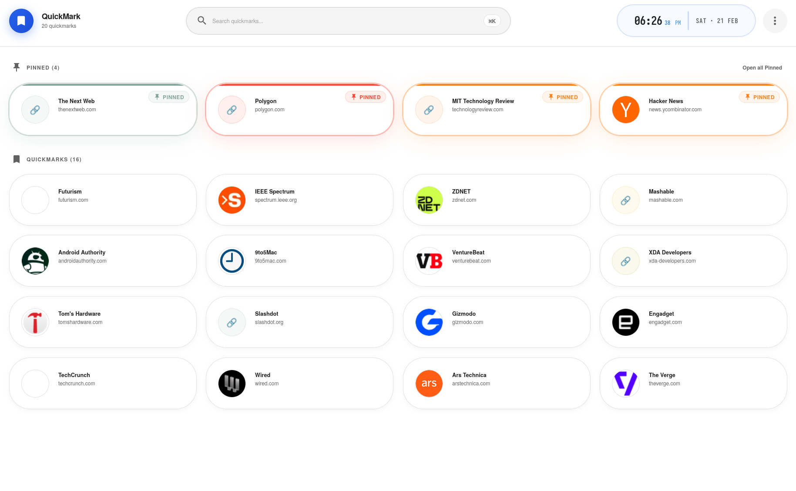

# QuickMark


A minimal bookmark manager that works entirely in your browser or as a single HTML file. No accounts, no cloud, just local storage.


## Screenshot



## Quick Start

Navigate to https://quickmark.rubenk.dev

Or run locally:

```bash
npm install
npm run dev      # http://localhost:5173
npm run build    # output in dist/
```

## License

MIT
